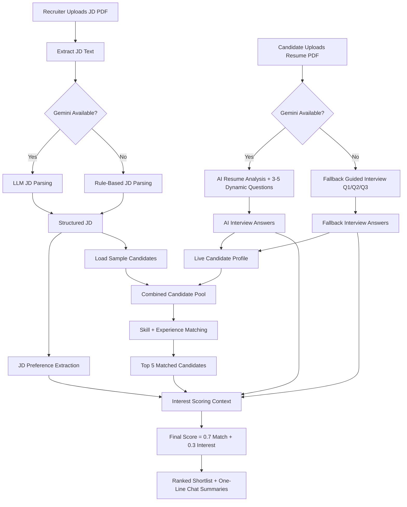

# Architecture and Logic

## High-Level Flow

1. Recruiter uploads JD PDF (or pastes JD text) in left panel
2. App extracts text from PDF
3. JD parser creates structured requirements:
   - skills
   - experience
   - role
   - keywords
4. Candidate uses right panel in one of two faces:
   - Face 1 (AI mode): upload resume PDF -> AI generates 3-5 dynamic questions -> one-by-one chat answers
   - Face 2 (fallback mode): manual profile + guided Q1/Q2/Q3 interview
5. App auto-switches to fallback face when Gemini key is unavailable/invalid/rate-limited
6. JD preference extraction derives optional constraints:
   - salary range (if present)
   - work mode preference (Remote/Hybrid/Onsite)
7. Candidate pool is built from:
   - built-in sample candidates
   - live candidates from AI face or fallback face (additive, same schema)
8. Candidate matcher computes match score with explainability
9. Conversation source for interest:
   - AI resume interview answers for AI-face candidates
   - guided fallback answers for fallback-face candidates
   - simulated outreach for sample candidates
10. Processing is limited to top 5 matched candidates for interview/conversation scoring
11. Final scorer ranks candidates
12. UI shows parsed JD + ranked shortlist with one-line chat summaries

## System Components

- UI Layer: Streamlit two-pane layout (left JD search, right live conversation)
- UX Layer:
  - dual-face candidate panel (AI face + fallback face)
  - auto-select + auto-scroll for fallback interview path
- Key Management: in-app Gemini key input (password field) with fallback toggle
- Ingestion Layer: PDF parser (`pypdf`)
- AI Layer: Gemini via `google-genai` (optional)
- Rule Layer: deterministic fallback parser, fallback interview scorer, and outreach simulation
- Scoring Layer: weighted formula ranking
- Ranking Optimization Layer: top-5 shortlist cap for lower latency in LLM mode

## Mermaid Diagram

## Scoring Details

- `skill_overlap = |JD_skills ∩ candidate_skills| / max(|JD_skills|, 1)`
- `experience_fit = min(candidate_exp / jd_exp, 1)` (or `1` if JD exp missing)
- `match_score = 0.6 * skill_overlap + 0.4 * experience_fit`
- `interest_score`:
  - live candidates (AI face): computed from AI interview responses + JD context
  - live candidates (fallback face): computed from guided answers and JD alignment
    - openness to opportunities
    - salary expectation fit
    - remote preference fit
  - non-live candidates: from simulated outreach transcript sentiment
- `final_score = 0.7 * match_score + 0.3 * interest_score`
- final output list is capped to top 5 candidates

## Explainability

Each candidate includes:

- matched skill count explanation
- match score
- interest score
- final score
- one-line chat summary for ranked output

Live candidates additionally provide:

- interview-based genuine-interest note (AI or fallback path)
- session-level candidate profile entry in the same schema as sample data

## Reliability Strategy

- Startup model check for preferred Gemini models
- Automatic fallback from AI interview face to guided fallback face on API errors/quota failures
- Automatic fallback to non-LLM mode for JD/conversation processing on API errors/quota failures
- Deterministic output path for demo continuity
- Live candidate profiles append without modifying built-in sample candidate records
