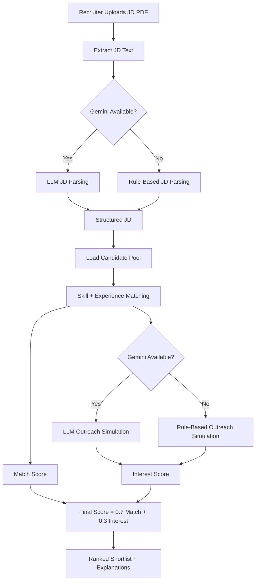

# Architecture and Logic

## High-Level Flow

1. Recruiter uploads JD PDF (or pastes JD text)
2. App extracts text from PDF
3. JD parser creates structured requirements:
   - skills
   - experience
   - role
   - keywords
4. Candidate matcher computes match score with explainability
5. Outreach simulator generates candidate interest response
6. Final scorer ranks candidates
7. UI shows parsed JD + ranked shortlist

## System Components

- UI Layer: Streamlit
- Ingestion Layer: PDF parser (`pypdf`)
- AI Layer: Gemini via `google-genai` (optional)
- Rule Layer: deterministic fallback parser and outreach simulation
- Scoring Layer: weighted formula ranking

## Mermaid Diagram

## Scoring Details

- `skill_overlap = |JD_skills ∩ candidate_skills| / max(|JD_skills|, 1)`
- `experience_fit = min(candidate_exp / jd_exp, 1)` (or `1` if JD exp missing)
- `match_score = 0.6 * skill_overlap + 0.4 * experience_fit`
- `interest_score`:
  - positive intent => `1.0`
  - negative intent => `0.0`
  - unclear => `0.5`
- `final_score = 0.7 * match_score + 0.3 * interest_score`

## Explainability

Each candidate includes:

- matched skill count explanation
- match score
- interest score
- final score
- simulated conversation transcript

## Reliability Strategy

- Startup model check for preferred Gemini models
- Automatic fallback to non-LLM mode on API errors/quota failures
- Deterministic output path for demo continuity
