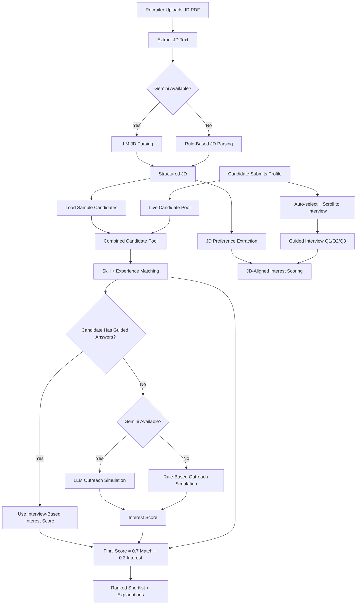

# Architecture and Logic

## High-Level Flow

1. Candidate submits profile in right panel (name, skills, experience, domain)
2. UI auto-selects that candidate and scrolls to guided interview section
3. Live conversation agent runs guided interview:
   - Q1: Open to opportunities?
   - Q2: Expected salary? (LPA)
   - Q3: Remote preference?
4. Agent computes genuine-interest score by matching interview answers to JD preferences
5. Recruiter uploads JD PDF (or pastes JD text) in left panel
6. App extracts text from PDF
7. JD parser creates structured requirements:
   - skills
   - experience
   - role
   - keywords
8. JD preference extraction derives optional constraints:
   - salary range (if present)
   - work mode preference (Remote/Hybrid/Onsite)
9. Candidate pool is built from:
   - built-in sample candidates
   - live submitted candidates (additive, same schema)
10. Candidate matcher computes match score with explainability
11. Conversation source for interest:
   - guided interview answers for submitted candidates
   - simulated outreach for sample candidates
12. Final scorer ranks candidates
13. UI shows parsed JD + ranked shortlist

## System Components

- UI Layer: Streamlit two-pane layout (left JD search, right live conversation)
- UX Layer: auto-select + auto-scroll to interview after candidate profile submit
- Key Management: in-app Gemini key input (password field) with fallback toggle
- Ingestion Layer: PDF parser (`pypdf`)
- AI Layer: Gemini via `google-genai` (optional)
- Rule Layer: deterministic fallback parser, guided interview scorer, and outreach simulation
- Scoring Layer: weighted formula ranking

## Mermaid Diagram

## Scoring Details

- `skill_overlap = |JD_skills ∩ candidate_skills| / max(|JD_skills|, 1)`
- `experience_fit = min(candidate_exp / jd_exp, 1)` (or `1` if JD exp missing)
- `match_score = 0.6 * skill_overlap + 0.4 * experience_fit`
- `interest_score`:
  - live candidates: computed from guided answers and JD alignment
    - openness to opportunities
    - salary expectation fit
    - remote preference fit
  - non-live candidates: from simulated outreach transcript sentiment
- `final_score = 0.7 * match_score + 0.3 * interest_score`

## Explainability

Each candidate includes:

- matched skill count explanation
- match score
- interest score
- final score
- simulated conversation transcript

Live candidates additionally provide:

- interview-based genuine-interest note
- session-level candidate profile entry in the same schema as sample data

## Reliability Strategy

- Startup model check for preferred Gemini models
- Automatic fallback to non-LLM mode on API errors/quota failures
- Deterministic output path for demo continuity
- Live candidate profiles append without modifying built-in sample candidate records
